# Architecture Overview

This document provides a high-level overview of the Shedrick Flowers Photography Web application architecture.

## System Diagram

```mermaid
graph TB
    subgraph "Client (Browser)"
        subgraph "Public Pages"
            Home["🏠 Home"]
            Portfolio["📷 Portfolio"]
            Blog["📝 Blog"]
            Services["💼 Services"]
            About["👤 About"]
            Contact["📧 Contact"]
        end

        subgraph "Admin Dashboard"
            AdminDash["📊 Dashboard"]
            AdminPortfolio["🖼️ Portfolio Manager"]
            AdminBlog["✍️ Blog Manager"]
            AdminServices["💰 Services Manager"]
            AdminTestimonials["⭐ Testimonials"]
            AdminSettings["⚙️ Settings"]
            AdminComments["💬 Comments"]
        end

        subgraph "Shared Components"
            Layout["Layout.tsx"]
            Navigation["Navigation.tsx"]
            StudioAssistant["StudioAssistant.tsx"]
        end
    end

    subgraph "Services Layer"
        SupabaseClient["supabaseClient.ts<br/>CRUD Operations"]
        Storage["storage.ts<br/>Image Upload"]
        ImageOptimizer["imageOptimizer.ts<br/>Client-side Optimization"]
    end

    subgraph "Supabase Backend"
        Auth["🔐 Authentication"]
        DB[("PostgreSQL<br/>7 Tables")]
        StorageBucket["🪣 Storage Bucket<br/>(images/)"]
        EdgeFn["⚡ Edge Function<br/>(gemini-chat)"]
    end

    Home --> SupabaseClient
    Portfolio --> SupabaseClient
    Blog --> SupabaseClient
    Services --> SupabaseClient
    About --> SupabaseClient
    Contact --> SupabaseClient

    AdminDash --> SupabaseClient
    AdminPortfolio --> Storage
    AdminBlog --> Storage
    AdminSettings --> Storage

    Storage --> ImageOptimizer
    ImageOptimizer --> StorageBucket
    SupabaseClient --> DB
    SupabaseClient --> Auth

    StudioAssistant --> EdgeFn
    EdgeFn --> Gemini["🤖 Google Gemini API"]
```



## Technology Stack

| Layer         | Technology                      | Purpose                                   |
| ------------- | ------------------------------- | ----------------------------------------- |
| **Frontend**  | React 19 + Vite                 | UI framework and build tool               |
| **Routing**   | React Router v7                 | Client-side navigation (HashRouter)       |
| **Styling**   | Tailwind CSS (CDN)              | Utility-first CSS framework               |
| **State**     | React Context + Hooks           | Local state management                    |
| **Backend**   | Supabase                        | PostgreSQL, Auth, Storage, Edge Functions |
| **AI**        | Google Gemini                   | Studio Assistant chat functionality       |
| **Icons**     | Lucide React + Material Symbols | UI iconography                            |
| **Rich Text** | @tiptap/react                   | Blog post content editor                  |

## Directory Structure

```
├── src/
│   ├── components/         # Reusable UI components
│   │   ├── admin/          # Admin-specific components
│   │   └── layouts/        # Layout wrappers
│   ├── context/            # React Context providers
│   ├── pages/              # Route components
│   │   └── admin/          # Admin dashboard pages
│   ├── services/           # API/backend integration
│   ├── utils/              # Helper functions
│   └── types.ts            # TypeScript interfaces
├── supabase/
│   └── functions/          # Edge Functions (Deno)
├── docs/                   # Documentation
└── [config files]          # Vite, TypeScript, Docker configs
```

## Performance Patterns

The application implements several performance optimizations documented in the `.jules/bolt.md` journal.

1.  **Static Data Caching**: `sessionStorage` is heavily utilized for data that changes infrequently (e.g., Portfolio, Services) to simulate a "static site" feel. This reduces network requests during a user session.
2.  **Lazy State Initialization**: `useState(() => localStorage.getItem('key'))` is used to ensure storage access only happens on the initial render, preventing synchronous blocking.
3.  **BlurImage Optimization**: The `BlurImage` component uses `useMemo` and synchronous state updates (via `prevProps` pattern) to prevent flashes of stale content and unnecessary re-renders.
4.  **Optimized Lists**: Admin lists (e.g., Blog Manager) fetch partial data (excluding large content fields) to minimize payload size.

## Security Patterns

Critical security defenses documented in `.jules/sentinel.md`:

1.  **Fail Securely (Edge Functions)**: Functions catch all exceptions and return generic "Internal Server Error" messages to the client, logging actual details only to the server console.
2.  **Strict URL Validation**: All user-provided URLs (e.g., in Settings) are validated to prevent `javascript:` URI attacks.
3.  **Reverse Tabnabbing Protection**: A centralized `sanitizeHtml` utility enforces `rel="noopener noreferrer"` on all external links.
4.  **Strict Output Encoding**: `DOMPurify` is used to sanitize all rich text content before rendering.

## Database Schema

Seven tables power the application:


## Data Flow

### Public Content Flow

1. User visits page → React component mounts
2. Component calls `supabaseClient.fetchData()` or specific fetch function
3. Supabase returns data (filtered by RLS policies for `anon` role)
4. Component renders content

### Admin Content Flow

1. Admin authenticates via Supabase Auth
2. `ProtectedRoute` validates session
3. Admin modifies content via admin components
4. Components call `createItem()`, `updateItem()`, `deleteItem()`
5. Supabase RLS policies allow `authenticated` role
6. For images: `imageOptimizer.ts` → `storage.ts` → Supabase Storage

### AI Chat Flow

1. User opens Studio Assistant on Contact page
2. Component sends message to `gemini-chat` Edge Function
3. Edge Function fetches current Services/Settings from database
4. Edge Function calls Google Gemini API with context
5. Response streams back to client

## Authentication

- **Provider**: Supabase Auth (email/password)
- **Protected Routes**: All `/admin/*` routes wrapped in `ProtectedRoute.tsx`
- **Session**: Managed via Supabase client, stored in localStorage
- **RLS**: Row Level Security policies enforce access control at database level

## Storage Organization

The `images` bucket contains organized subfolders:

```
images/
├── portfolio/      # Portfolio gallery images
├── blog/           # Blog post featured images
├── testimonials/   # Client testimonial photos
└── services/       # Service tier images
```

Files are automatically renamed with timestamps to prevent collisions.
